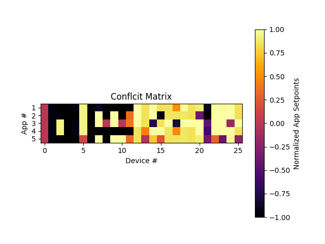
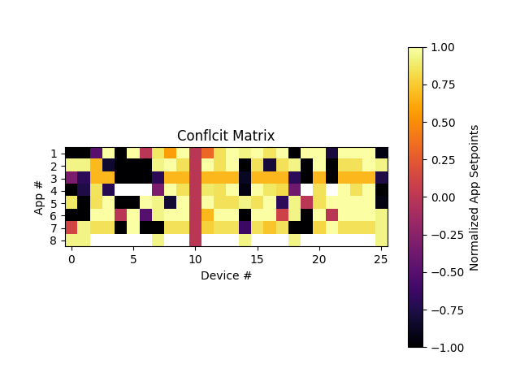
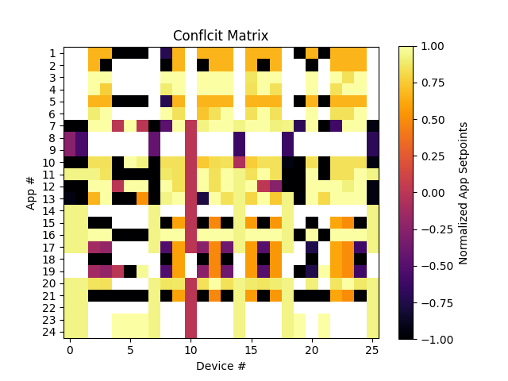
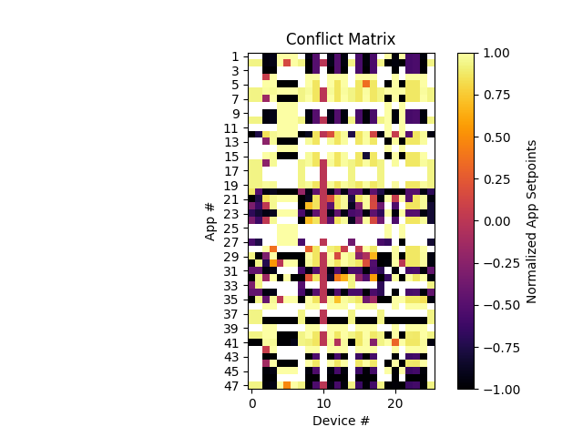

# app-deconfliction/service

Author: Gary Black <br>
Last updated: July 2, 2025

## Purpose

The service directory of the app-deconfliction repository contains the entirety of the FY24/FY25 service that uses GridLAB-D simulations. Apps using both the PuLP and CVXPY optimization libraries with objectives for resilience, max_local (maximize local generation), and conservation voltage reduction (CVR) are supported for the FY24/FY25 service.

## Overview

The Centralized Deconfliction Service builds on the FY23 prototype following the design described in the project foundational paper published in IEEE Access and available at <https://ieeexplore.ieee.org/document/10107708>, specifically sections III-B and -C. There are methods in deconfliction-pipeline.py code directly corresponding to subsections in the foundational paper, e.g., SetpointProcessor, ConflictIdentification, and DeviceDispatcher. The service extends what was done in the prototype by applying the combined or staged deconfliction methodology first described in the end of FY23 Deconfliction Alternatives Analysis paper as well as integrating with GridLAB-D simulations.

The deconfliction workflow kicks off with GridLAB-D simulation measurement messages that provide updated device setpoints and battery SoC data. Competing apps subscribe to the GridLAB-D measurements to carry out their work (optimizations) determining and publishing new device setpoint requests via CIM DifferenceBuilder messages. The deconfliction service intercepts these DifferenceBuilder messages from competings apps to perform the steps described in the Foundational and Alternatives Analysis papers producing deconflicted setpoints dispatched to devices also through CIM DifferenceBuilder messages. The service exchanges messages with competing apps during an iterative stage of deconfliction that incentivizes apps to cooperate in trying to reach consensus setpoint values. Subsequent GridLAB-D simulation measurement messages reflect these deconflicted setpoints and are processed by competing apps, thus completing the deconfliction workflow loop.

For details on the combined/staged deconfliction methodology implemented in the FY24/FY25 Centralized Deconfliction Service, please see the Functional Specification document for the service at <https://github.com/GRIDAPPSD/gridappsd-training/blob/main/module-content/docs/source/services/app-deconfliction/FY24ServiceFunctionalSpecFinal.md>.

## Directory layout

```` bash
.
├── README.md
├── run-deconfliction.sh
├── sim-starter
    ├── sim-starter.py
    ├── 123apps-config.json
    ├── ...
    └── 123apps_model
        ├── ieee123apps.xml
        ├── InsertMeasurementsOld.py
        ├── ListMeasureablesOld.py
        ├── insert_measurements_123apps.sh
        └── list_measurements_123apps.sh
├── optimization-apps
    ├── optimization-app-pulp.py
    ├── optimization-app-cvxpy-modular.py
    ├── run-resilience.sh
    ├── run-max_local.sh
    ├── run-cvr.sh
    ├── run-scalability.sh
    └── ...
├── deconfliction-pipeline
    ├── deconfliction-pipeline.py
    ├── run-pipeline.sh
    └── ...
└── shared
    ├── AppUtil.py
    ├── MethodUtil.py
    └── sparql.py
````

Note "..." indicates files similar to the one preceding and there are additional files in the repo that are omitted in the layout above and not important to the understanding of the deconfliction service.

## Prerequisites

<ol>
<li>
Here are some practical hints for getting up and going with the deconfliction service that may be helpful especially if creating a new VirtualBox VM:
<ul>
<li>
Use Ubuntu version 22.04 rather than anything newer including 24.04 as 22.04 includes Python 3.10 which is the newest Python3 that is compatible with GridAPPS-D.
</li>
<li>
Recommendations for a VirtualBox VM, if using VirtualBox, are a VM with 48 GB of memory (given a 64 GB host), 4 processors, 128 MB video memory, and a 512 GB dynamically allocated disk.
</li>
<li>
Proceed through the Ubuntu installation GUI pages. After some short period after finished a popup about installing new updates should be presented. Restart the VM at this point to get those updates.
</li>
<li>
From Devices menu select "Insert Guest Additions CD Image...". Click on the added CD icon along the lefthand side and then hit the "Run Software" button or right click on the autorun.sh file and select the run item. In the output from this there is a message about needing to install gcc, make, and perl. This can be ignored. Need to restart the VM with "Send the shutdown signal" option.
</li>
<li>
On restart there should be choices for screen size under View->Virtual Screen 1. Recommended selection is 1920x1080.
</li>
<li>
Turn off screen lock settings by right clicking over desktop background and selecting "Display Settings". Then from the dialog select Privacy->Screen.
</li>
<li>
Setup a shared folder using Devices->Shared Folders->Shared Folders Settings. Hit "+" to create a new shared folder. Mount point should be /media/username along with selecting automount and make permanent. Add username to the vboxsf group in /etc/group and logout and back in again for group change to take effect.
</li>
<li>
Run "sudo apt install git" and create ~/git directory
</li>
<li>
git clone both https://github.com/GRIDAPPSD/gridappsd-docker and https://github.com/GRIDAPPSD/app-deconfliction
</li>
<li>
Using the shared folder copy over the ~/.git-credentials file from an existing VM in order to get the github token needed for making git repo changes. Put this file in place as ~/.git-credentials in the new VM. Make a trivial change to an existing file such as in the app-deconfliction repo and git add/commit/push this change. The push will ask for username and the token (password) which is in the ~/.git-credentials file. Enter these and then run "git config credential.helper store" so these don't need to be entered going forward.
</li>
</ul>
<li>
You must have the dockerized GridAPPS-D platform running which is available at https://github.com/GRIDAPPSD/gridappsd-docker. Follow the documentation there if you are unfamiliar with running the platform. To get the run.sh script to run may need to do a "sudo apt install docker-compose" and "sudo rm /usr/local/bin/docker-compose". Also, note that app-deconfliction currently is not compatible with anything newer than the v2023.07.0 version of the platform. That's currently the default if a -t value is not given to run.sh, but that could change since the version in run.sh hasn't been updated in a couple years. Definitely can't do "./run.sh -t develop" and have it work with app-deconfliction. There are about 850 lines of query code in the app-deconfliction/service/shared directory for instance that haven't been updated to work with CIM-graph.
</li>

<li>
Python version 3.8 or newer is required (although not newer than 3.10 currently) as the one in your $PATH and can be checked with the command "python3 --version".
</li>

<li>
The gridappsd-python package must be installed in Python. To check if this package is already installed:

```` bash
$ python
>>> import gridappsd
````

If the import returns an error message, see <https://github.com/GRIDAPPSD/gridappsd-python> for installation instructions. May need to do a "sudo apt install python-pip3" to be able to do the "sudo pip3 install gridappsd-python" needed to install this package.
</li>

<li>
An updated version of the IEEE 123-bus model defining batteries and solarPVs not yet included in the standard GridAPPS-D platform distribution must be loaded after starting the platform. The CIM model for this updated test feeder is exported to the sim-starter/123apps_model directory. Open the Blazegraph URL in the web browser and upload the file ieee123apps.xml using the "UPDATE" tab from http://localhost:8889/bigdata/#update (hit "Browse..." button to select file).

Note that as long as docker containers are not cleared with the "./stop.sh -c" command, it is possible to stop and start the platform repeatedly without reloading this updated 123-bus model.
</li>

<li>
Along with uploading the ieee123apps.xml file under Blazegraph, measurements for this model must be inserted. From ~/git do a git clone of https://github.com/GRIDAPPSD/CIMHub. Then from the app-deconfliction/service/sim-starter/123apps_model directory copy the two .py files to ~/git/CIMHub/src_python/cimhub and then copy the two .sh files to ~/git/CIMHub. Do "sudo pip3 install SPARQLWrapper" unless the SPARQLWrapper package has already been installed in python3. Change directory to ~/git/CIMHub and run "./list_measurements_123apps.sh" which will generate a number of .txt files with a prefix of "ieee123_app_deconfliction_". Finally, run "./insert_measurements_123apps.sh" to add the measurements defined in these .txt files.
</li>

<li>
Various other Python packages are required to run the different processes that are part of the deconfliction service. The recommended approach is to run one-by-one each required deconfliction process through initialization to identify missing packages. Missing packages should be installed until the process successfully initializes at which time the same initialization test can be done for the next process. The following steps walk through running each deconfliction process and cover the most likely missing packages.
</li>

<li>
To test a competing app (all apps use the same base code varying primarily in the objective function) from a shell in the service directory:

```` bash
$ cd optimization-apps
$ ./run-resilience.sh 123apps standalone
````

Note the final argument of "standalone" must be present to perform a standalone invocation as needed for this test. If you get a line out output of the form "Initialized ..., waiting for messages..." after some query output, this demonstrates successful initialization and you may do a ctrl-C exit. It is best to test both a PuLP and CVXPY optimization app since each uses some different packages. The test above is for CVXPY, but PuLP can be tested with:

```` bash
$ ./run-resilience.sh 123apps standalone pulp
````

There is little to be gained from trying the max_local or cvr objectives in addition to resilience, but they also support the standalone argument. Modules likely to be missing for the competing apps include numpy, tabulate, pulp, and cvxpy. The following install commands may prove helpful based on failed imports:

```` bash
$ sudo pip3 install numpy
$ sudo pip3 install tabulate
$ sudo apt-get install glpk-utils
$ sudo pip3 install pulp
$ sudo pip3 install cvxpy[CBC,CVXOPT,GLOP,GLPK]
$ sudo pip3 install pandas
````

Note that glpk-utils is needed by the PuLP and CVXPY optmization packages and must be installed before installing the optimization packages.
</li>

<li>
To test the core deconfliction-pipeline process assuming you were in the optimization-apps directory:

```` bash
$ cd ../deconfliction-pipeline
$ ./run-pipeline.sh 123apps standalone
````

Note the final argument of "standalone" must be present to perform a standalone invocation as needed for this test. If you get a line of output of the form "Initialization--finished, waiting for messages..." after some query output, this demonstrates successful intialization and you may do a ctrl-C exit.
</li>
</ol>

## Running deconfliction service

The deconfliction service can be run either as individual processes running in separate terminals or from a single wrapper shell script encompassing all processes. Running from the wrapper script will suffice in most all instances including if there is a need to scrutinize running diagnostic terminal output from all processes. Therefore no further description will be provided on running the individual processes other than to note that the run-deconfliction.sh wrapper script logic can be studied to learn what is going on under the covers.

The run-deconfliction.sh wrapper script in the service directory is your one-stop shop for running deconfliction. Comments at the top of the script provide guidance on command line arguments, with the basic usage being:

```` bash
$ ./run-deconfliction.sh <MODEL> <APPS> [--optlib <OPTLIB>] [--interval <INTERVAL>] [--weights <WEIGHTS>]
````

where \<MODEL\> is a shorthand used for looking up the full GridAPPS-D simulation request and feeder mrid. Currently, the only \<MODEL\> value supported for the deconfliction service is "123apps", which uses the updated IEEE 123-bus model that includes batteries, assuming that has been loaded into the GridAPPS-D platform per the guidance above.

\<APPS\> is a shorthand code composed of the first letters for each of the competing apps to run. The possible apps are resilience, code "r" or "R"; max_local, code "m" or "M", and CVR, code "c" or "C". Thus, "rmc" would run all three apps and "rm" would run resilience and max_local without CVR. There is also an "s" code for running app scalability test suites as described in App Scalability section below.

\<OPTLIB\> is the optional name of the optimization library to use for competing apps. If the value is "pulp" then the PuLP library will be used. Otherwise, the CVXPY library will be used.

\<INTERVAL\> is the optional integer value in seconds at which competing apps will perform optimizations and send setpoints requests via CIM DifferenceBuilder messages. The value, if specified, must be a multiple of 3 for compatibility with GridLAB-D simulations. If not specified, the competing apps will use an appropriate default value such as 15 seconds, meaning an optimization will be performed every fifth simulation measurements message from GridLAB-D. A value of 3 corresponds to an optimization for every GridLAB-D measurements message. In cases other than stress testing the deconfliction service it is recommended a multiple of 3 in the range of 9-18 be used. Better yet, omit this optional argument unless there is an important reason for specifying it.

\<WEIGHTS\> allows application and/or device weighting factors to be read from files and applied during the optimization stage of deconfliction. However, the use of file-based weights currently interferes with the weights applied automatically during the cooperation stage of deconfliction as weights are critical to incentivizing apps to participate in cooperation. Therefore, this argument should not be specified and is only included as a possible future enhancement for combining cooperation incentive weights with file-based weights.

With all of that as background, as example invocations of run-deconfliction.sh, consider the following:

```` bash
$ ./run-deconfliction.sh 123apps rm
$ ./run-deconfliction.sh 123apps rmc
$ ./run-deconfliction.sh 123apps rmc pulp
````

In the first invocation, the resilience and max_local competing apps are run with a GridLAB-D simulation for the batteries-included IEEE 123 node model. In the second invocation, the CVR app is add in as well. In the third invocation, the PuLP optimization library is used for the competing apps instead of the default CVXPY library.

The run-deconfliction.sh wrapper script normally only shows diagnostic log output for the deconfliction pipeline process in the terminal where the wrapper script is invoked. However, each of the processes produces a log file that can either be viewed during the run (typically via "tail -f") or afterwards. These files are written to a log subdirectory--optimization-apps/log for the competing apps and deconfliction-pipeline/log for the pipeline process. If you are interested in the briefest of workflow progress output such as for a simple demonstration a "grep" for the ">>>" pattern will do the job. For example, to tail this workflow overview during a running simulation, change directory to deconfliction-pipeline/log and issue the command: tail -f deconfliction-pipeline.log | grep ">>>"

Although the run-deconfliction.sh wrapper script starts a number of processes, some of them as background jobs, there is special logic that "traps" ctrl-C exits from the script and properly terminates all jobs associated with the deconfliction service such as competing apps. Note that in the case of a ctrl-C exit from the wrapper script that a GridLAB-D simulation that has been started will not be terminated and instead run to completion.

## App Scalability Task

For the FY25 App Scalability Task the CVXPY optimization app was reworked to support specifying combinations of objectives and optimization problem features to include and exclude for each run of a scalability test suite. The configuration of the test suite is given in a CSV file with each line representing an optimization app instance or run. This version of the app is named optimization-app-cvxpy-modular.py and there is a new mode of invoking the optimization app instances and deconfliction pipeline through the run-deconfliction.sh wrapper script specifically for app scalability testing.

In addition to reworking or modularizing the code for scalability testing two other power flow modeling enhancements were made to this code. First, reactive or "Q" power flow is now supported where previously only active power flow was modeled. Secondly, SolarPVs or PhotovoltaicUnits are now controllable devices where the updated optimization app determines the complex power flow solution for these and requests device updates with CIM difference builder messages.

The five objectives that have been defined in optimization-app-cvxpy-modular.py are:
<ol>
<li>CVR
<li>Power Factor
<li>Arbitrage (cost)
<li>Peak load
<li>Resilience
</ol>

Each of these objectives can be set individually or any combination of them can be specified for an app instance including weighting factors for each objective. The eight optimization problem features that can be toggled on or off for specifying an app instance are:

<ol>
<li>Energy consumers
<li>Active or "P" SolarPVs
<li>Reactive or "Q" SolarPVs
<li>Batteries
<li>Regulators
<li>Active or "P" power flow
<li>Reactive or "Q" power flow
<li>Voltages
</ol>

To run an app scalability task test, the run-deconfliction.sh wrapper script takes a special value for the \<APPS\> argument instead of the usual shorthand code for the objective functions to run. This is a value of "s" for scalability testing which results in the app instances being defined in a file named app_setup.csv in the optimization-apps directory. The default app_setup.csv filename can also be changed by passing the name to use as the command line argument after the "s" code. E.g., "./run-deconfliction.sh 123apps s app_setup_50.csv" would invoke an app scalability suite defined in the app_setup_50.csv file.

The first line of app_setup.csv is the header defining the comma-separated value fields and each line after the first defines an instance of the app. The first field, AppName, is used for the name of log files in the optimization-apps/log directory, in the deconfliction-pipeline/log/plot_data.csv file containing data for plotting, message passing between apps and the deconfliction pipeline, and for internal data structures for the pipeline such as ConflictMatrix. The second field is a space-separated vector with the weights for each of the five objective functions. A value of zero specifies that the objective should not be included and any positive floating point value indicates to apply that objective, numbers 1 through 5, with the weighting factor of that floating point value. Normally the sum of the weights should add up to 1.0 so if a single objective is applied it should have a weight of 1. If all five objectives are to be applied with equal weight, the vector would be "[0.2 0.2 0.2 0.2 0.2]". When combining multiple objectives each is multiplied by the corresponding weight and summed into an overall objective for the app instance. The third field is the first of the eight features that can be include or not in the optimization instance. A value of "1" indicates to include the feature while a value of "0" indicates to exclude or omit the feature. The remaining seven fields are the rest of include/exclude feature values.

While app scalability testing allows a large combination of objectives and features, there are a few dependencies between the various features in order for the optimization problem to be properly defined. Further, there are additional dependencies that need to be followed to produce meaningful results even though the optimization problem is properly defined without adhering to these. Here are the dependencies to define a proper optimization:
<ul>
<li>includeEnergyConsumersFlag must always be "1"
<li>if includeVoltagesFlag is "1" then both includePFlowFlag and includeQFlowFlag must always be "1"
<li>if includeSolarPVsQFlag is "1" then includeSolarPVsFlag must always be "1"
</ul>

Here are the dependencies to produce meaningful results:
<ul>
<li>if objective #1 is applied then includeVoltagesFlag must always be "1"
<li>if objective #2 is applied then both includePFlowFlag and includeQFlowFlag must always be "1"
<li>if objective #3 is applied then includeBatteriesFlag must always be "1"
<li>if objective #4 is applied then includePFlowFlag must always be "1"
<li>if objective #5 is applied then includeBatteriesFlag must always be "1"
</ul>

A helper script is provided in the optimization-apps directory to automate the generation of app scalability test suites, generate-app-setup.py. There are two optional command line arguments to this script, the first being the number of app instances in the test suite and the second being the name of a template file. The number of instances defaults to 10 if not specified and the template file defaults to "app_setup.csv" in the optimization-apps directory. If a template file is specified on the command line then the number of instances must be specified as well as they are positional command line arguments (the number of instances though can be given without a template file). To run generate-app-setup.py, issue "python3 generate-app-setup.py \<num_apps\> \<template_file\>" from the optimization-apps directory. The name of the output app scalability test suite file is taken from the template file name and defaults to app_setup_\<num_apps\>.csv. The template file is copied at the start of the output test suite with newly generated app instances following to fill out the remainder of the runs.

For performing app scalability testing where the deconfliction pipeline processing is not of concern, it is recommended that both rules and cooperation stages of deconfliction be turned off. This results in only optimization stage deconfliction (finding the centroid of all conflicting device setpoints) being applied to quickly produce a ResolutionVector from a ConflictMatrix. This specifically keeps apps from needing to respond to cooperation request messages from the pipeline to streamline communications. To facilitate this the run-deconfliction.sh wrapper script passes a flag to the deconfliction pipeline indicating it is an app scalability test with this resulting in rules and cooperation stages being skipped. To override this behavior, edit deconfliction-pipeline.py in the deconfliction-pipeline directory and search for "APP SCALABILITY" for guidance on code changes needed.

Conflict Matrix Snapshot for 5 Realistic Apps            |  Conflict Matrix Snapshot for 10 Apps
:-------------------------:|:-------------------------:
  |  

Conflict Matrix Snapshot for 25 Apps            |  Conflict Matrix Snapshot for 50 Apps
:-------------------------:|:-------------------------:
  |  

## FY25+ TO-DO

<ul>
<li>Get file-based weights working in combination with automatic cooperation incentive weights or toss the file-based weights feature.
<li>Need to get the modified 123apps model added to the default GridAPPS-D platform distribution.
<li>Register the deconfliction service as a formal service in the GridAPPS-D platform.
<li>Design changes to the GOSS-HELICS bridge allowing the deconfliction service to intercept CIM DifferenceBuilder messages sent to the GridLAB-D simulation.
<li>Support cooperation in competing apps with a modiified objective function given the intended phi function is non-linear/concave.
</ul>
